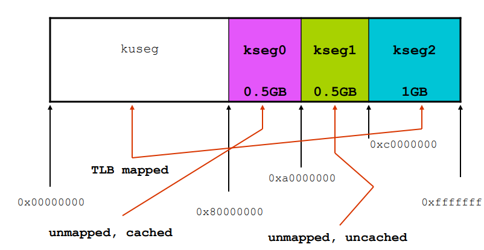

# Exams

## Exercise Paging
1.  Compute EAT with TLB

    _EAT_TLB = hit_ration * __T_ram__ + (1-hit_ration) * __T_ram__ * (levels+1)_

2.  Compute EAT with page fault
   
    _EAT_PF = (1-freq_page_fault) * __EAT_TLB__ + freq_page_fault * __T_page_fault___

    having EAT_TLB when there is no miss and T_page_fault for the miss case (it considers all the possible times as most relevant one)
3.  Compute empirical probability

    _f = prob1 * page_fault1 / len(word1) + prob2 * page_fault2 / len(word2) + ..._

    having p1+p2+... = 1
    
4.  Compute internal frammentation

## File indexing
1. Must a file start at the beginning of a block?
   No, the content of the file is independent of the file system and the disk on which it is stored. These are two different abstraction levels

2. Number of file blocks for a single, double or triple indirect index
   1. single:   _block_size / address_size_
   2. double:   _(block_size / address_size) * (block_size / address_size)_
   3. triple:   _(block_size / address_size) * (block_size / address_size) * (block_size / address_size)_

3. Count blocks:
    - Data blocks: 
        Single pointer == 1 data block
        Single indirect == above
        Double indirect == above
        Triple indirect == above
    - Index blocks:
        Single pointer == 0 index block
        Single indirect == 1
        Double indirect == 1 outer, at most  _block_size / address_size_ for the inner
        Triple indirect == 1 outer, at most  _block_size / address_size_ for the second level, at most  (_block_size / address_size_)^2 for the third level

4. Linked list:
   There are no index blocks, only data.
   Having a file, for the total amount of blocks required:
   _num_data_blocks = file_dim / (block_dim - pointer_dim)_
   
   Flow for reading a byte: (ie 7th byte of 6th blocks)
   -    Retrieve the FCB from RAM for getting the pointer to the first block (1)
   -    Read from disk each block and take them in RAM memory (6)
   -    Read each block by sequence of pointers till the requested block (5)
   -    Read the byte (1)
5. FAT:
   There are no index blocks, only data.
   _num_data_blocks = file_dim / block_dim_ 

    Flow for reading a byte: (ie 7th byte of 6th blocks)
   -    Retrieve the FCB from RAM for getting the pointer to the FAT table (1)
   -    Read over the FAT table till the required block (5) (now we have the pointer to disk)
   -    Read requested block from disk (1)
   -    Read the byte (1)

6. RAID:
   2 mirrored disk ==> MTTF_tot = MTTF/2
   p_dataLoss = p_failure_disk1 * p_failure_disk2_during_repair1
   MTTDL = MTTF/2 / (MTTR / MTTF) [repair time over failure time] = (MTTF^2)/(2*MTTR)

   
## Questions
1.  (27-06-2020) A user process wants to use an external device (IO) by polling strategy so watching the peripherical's status register. Is it possible?
   No, an IO device requires privileged instructions and CPU in kernel mode. A user process can't access that status register because it's not authorized if there are no system calls for providing it.
2.  (27-06-2020) Is it possible for a single read (via read()), to attempt to read from the device a vector of size larger than one block?
   It's possible because file dimension nor file format can change read() behavior. It means that more blocks will be read. 
3.  (27-06-2020) Struct proc and struct thread link
   Proc counts the number of threads while each of them has a pointer to the source process
```
        struct thread {
            char *t_name; 
            void *t_stack;      
            struct switchframe *t_contex
            struct proc *t_proc;     
        };

        

        struct proc {
            unsigned p_numthreads;      
            struct addrspace *p_addrspace;
            struct vnode *p_cwd;
        };
    
```
4.  (10-07-2020) Dynamic loading requires dynamic linking? And vice-versa?
   No for both questions
5.  (10-07-2020) TLB can contain entries from different processes? Yes
6.  (10-07-2020) Two processes call for open() over the same file, a SINGLE vnode will be created and pointed from both processes
7.  (10-07-2020) Can an entry of systemFileTable be shared?
   Yes, it happens after a fork() operation and the father and child will use the same openfile structure for using the file. (countRef for the current entry of systemFileTable will be increased)
8.  (15-02-2021) Why is systemFileTable a global variable, whereas fileTable is a field of struct proc?
    The first one is shared between all processes while fileTable is locally defined for each process
    IE:
    ```
        p1 {
            fileTable: [
                fileDescriptor1: READ (pointer to systemFileTable entry)
            ]
        }
        p2 {
            fileTable: [
                fileDescriptor1: READ (pointer to systemFileTable entry)
            ]
        }
    ```
    This will generate two different entries in systemFileTable, each process should be able to read (or seek) it at a different offset.

9.  (12-09-2020) C-scan and scan, what do they optimize?
    Seek time and mean seek distance
10. (12-09-2020) Noop scheduling (for non-volatile memory) stands for no scheduling (pure FIFO)
11. (12-09-2020) Switchframe and trapframe, syscalls use trapframe while the scheduling uses the first one
12. (12-09-2020) Switchframe is located at the kernel level, a user process can't access to it
13. (12-09-2020) Mapping IO devices in _kseg0_ (they are mapped in _kseg1_), is it possible?
    They are mapped in _kseg1_ because that memory section is not mapped, it's not possible to use _kseg0_ instead of _kseg1_ because it's mapped.
    
14. (12-09-2020) A user program can read/write from a kernel address? (_kseg0_)
    No, it needs privileges.
15. (15-02-2021) Why is backing store faster than file system IO?
    It is faster because the swap space is allocated in larger chunks and less management is needed than the file system.
16. (15-02-2021) Can swap space be less than virtual address space?
    Yes, it can be less than it because only used pages should be stored into the swap space
17. (16-01-2023)
    |   |Bigger page size|Smaller page size|
    |---|----------------|-----------------|
    |fragmentation||max internal fragmentation is pagesize-1 and it is reduced if pagesize is smaller |
    |page table size|bigger page size ==> less page ==> smaller page table||
    |overhead IO|time for moving blocks is constant so having bigger page size means we are moving more _useful_ information for what we need||
    |page fault amount|bigger page size ==> less fault||
    |locality|bigger page size ==> local program (all within the same page)|having a local program and smaller page size we are going to have _dense_ information so less memory is used|
    |TLB size|same as page table size||
18. (16-01-2023)
    Using a free list instead of the bitmap used in lab2 for managing memory in DUMBVM
    -   it could be ordered by physical addresses to optimize the search for a cluster of freed blocks. This means we need computation for maintaining it ordered but it's not relevant looking at the time needed for allocating contiguously (O(n^2))
19. (08-09-2022) Question about frame allocation asking for the difference between the equal one and the proportional one. Then it's asked if there are usable for implementing the working set technique.
    No, the firsts are FIXED technique for allocating frames while the second one is a variable so they are not compatible
20. (16-01-2023) Global substitution vs Local one
    |   |Global|Local|
    |---|------|-----|
    |less interference between processes||we can use only our own frames set|
    |memory usage||not optimized due to possible underutilized memory|
    |throughput|frames allocation to a process is balanced so a bigger one could use frames assigned to others which are not using them||
